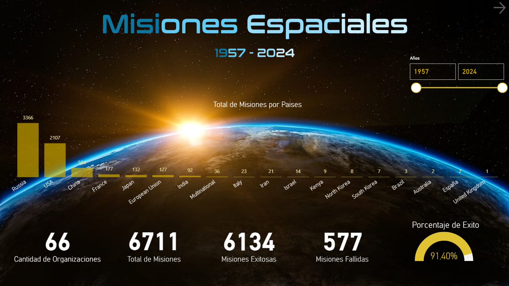
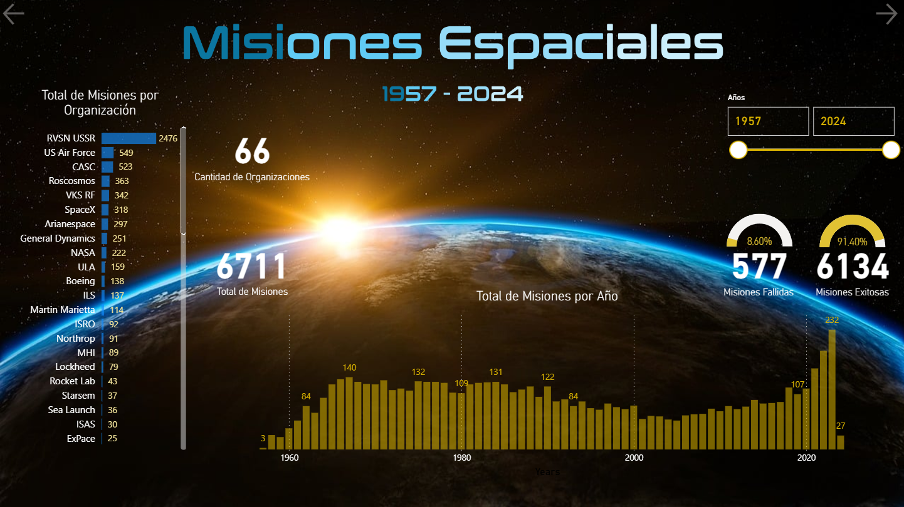
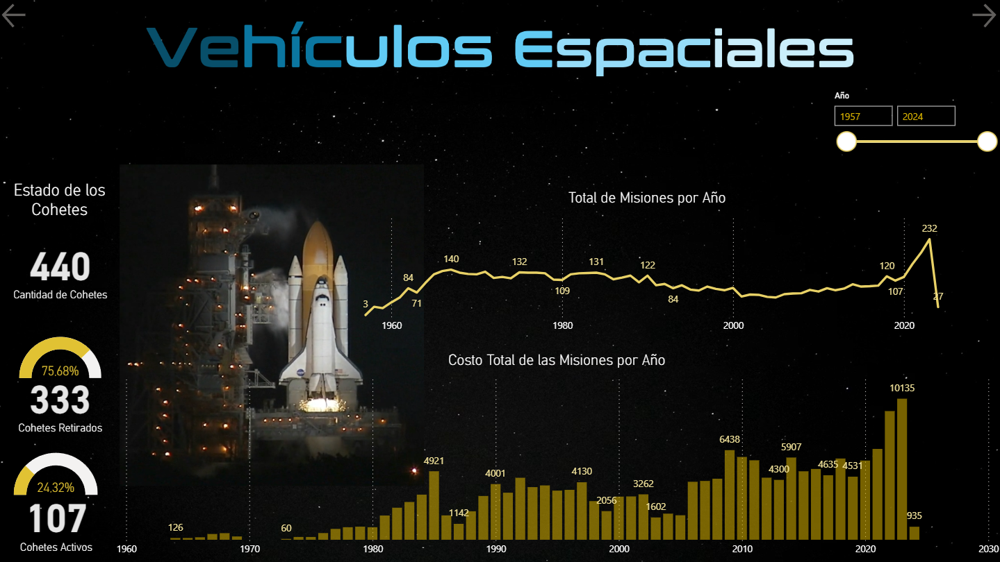
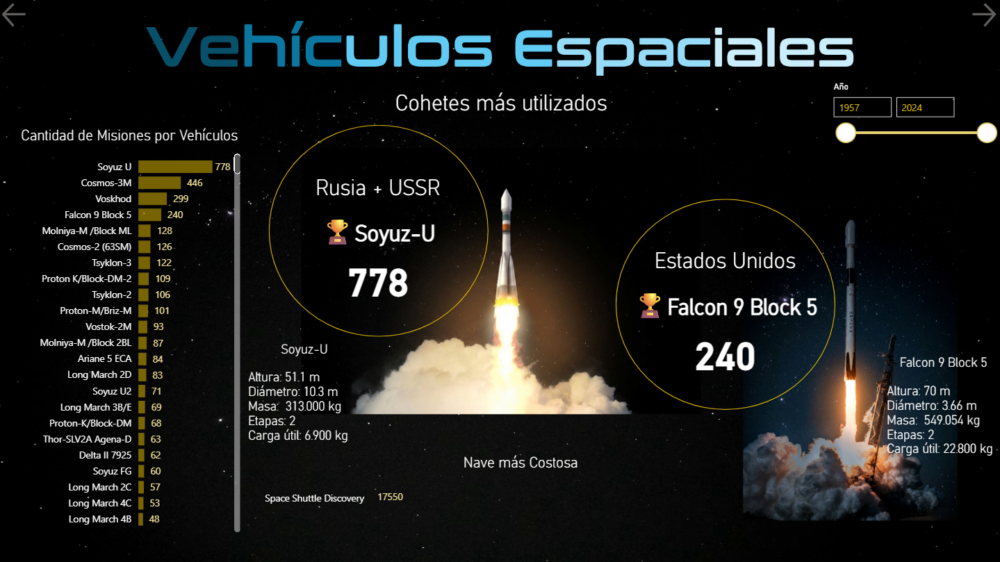
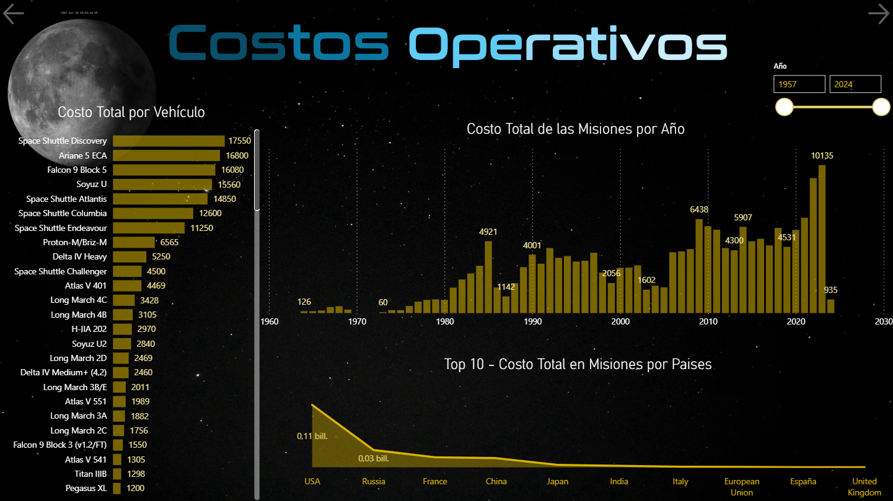
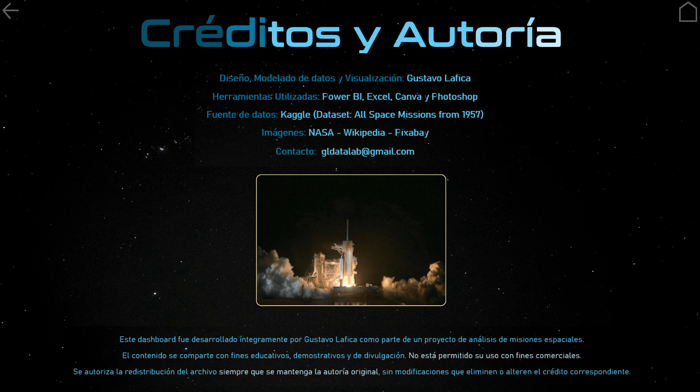
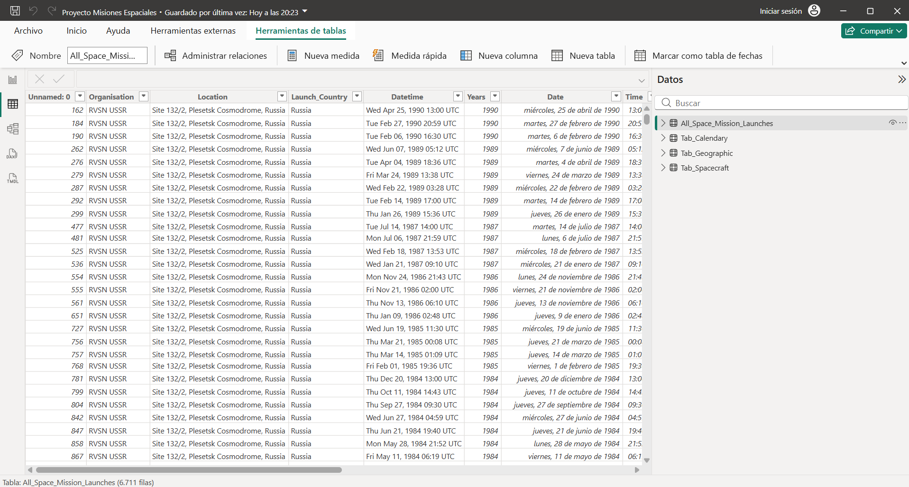
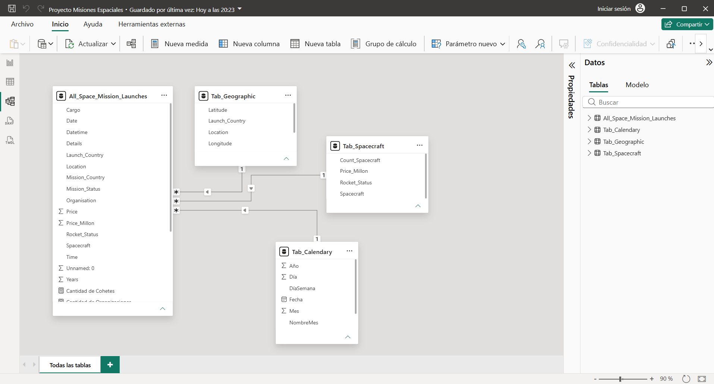

# Misiones Espaciales
Este directorio contiene análisis y métricas de costos de misiones espaciales.

---

  
### ▶️🎦 Haciendo clic en el botón podés ver en video todo el resultado final de mi trabajo 👇

# 📽️                

---

### 📒🛠️ Consigna del trabajo 👇

Representar un recorrido visual por la historia de la exploración espacial impulsado por datos.

### 🎯 Objetivo:

El objetivo de este trabajo fue analizar los 67 años de historia de las misiones espaciales (1957 - 2024) mediante un enfoque estadístico y visual, integrando información sobre países, organizaciones, vehículos, costos y resultados operativos para comprender la evolución global de la exploración espacial.

### 📝 Descripción:

Proyecto exploratorio desarrollado en Power BI que combina modelado de datos, análisis descriptivo y visualizaciones avanzadas para estudiar más de 6700 misiones espaciales. Incluye métricas por país, organización y vehículo, tasas de éxito, costos operativos, evolución temporal y comparativas históricas. El análisis integra fuentes heterogéneas del dataset de Kaggle y las transforma en un recorrido visual que resume tendencias, hitos y comportamientos del sector aeroespacial.

### 🌐 Fuente de datos: [Kaggle - All Space Missions from 1957](https://www.kaggle.com/datasets/agirlcoding/all-space-missions-from-1957)

### 📊 Principales KPIs:

- Total de Misiones (1957–2024): 6711

- Misiones Exitosas: 6134

- Misiones Fallidas: 577

- Porcentaje de Éxito Global: 91,40%

- Cantidad de Organizaciones: 66

- Total de Misiones por País: ranking encabezado por Rusia, USA y China

- Total de Misiones por Organización: RVSN USSR, US Air Force, CASC, Roscosmos, SpaceX, Arianespace, etc.

- Cohetes más utilizados: Soyuz-U (778), Cosmos-3M (446), Voskhod (299), Falcon 9 Block 5 (240)

- Costo Total por Vehículo: Space Shuttle Discovery (17.550), Ariane 5 ECA (16.800), Falcon 9 Block 5 (16.080), Soyuz-U (15.560)

- Costo Total por País: USA, Russia, France, China, Japan, India, EU, etc.

- Evolución de Misiones por Año: crecimiento sostenido desde 1957 con picos en décadas recientes

- Estado de los Cohetes: 75,68% retirados - 24,32% activos

   
  
## ⚙️ Tecnologías y herramientas aplicadas:

  
### 🛠️ Stack Técnico del Proyecto:

- Power BI Desktop - modelado, medidas DAX y visualizaciones.

- Excel - limpieza inicial y normalización de tablas.

- DAX Studio - optimización de consultas y validación de modelos.

- Canva - diseño visual de portadas y elementos gráficos.
  
- Photoshop - edición de imágenes y recursos visuales.

  

### 🧠 Procesos de Análisis de Datos:

- Integración de fuentes del dataset de Kaggle (All Space Missions 1957–2024).

- Limpieza, normalización y estandarización de campos (años, países, organizaciones, vehículos).

- Modelado de datos relacional para análisis por país, organización y vehículo.

- Creación de KPIs estratégicos: misiones totales, éxito, fallos, costos, actividad de cohetes.

- Análisis descriptivo y exploratorio (EDA) de tendencias históricas.
    

<!-- ### <ins> Visualizaciones avanzadas: </ins> el INS sirve para subrrayar-->

### 📈 Visualizaciones avanzadas: 

      ✓ Barras comparativas por país y organización

      ✓ Líneas de evolución anual

      ✓ Tablas de ranking

      ✓ Paneles de estado de cohetes

      ✓ Gráficos de costos por vehículo y país

Diseño de Storytelling visual para presentar 67 años de actividad espacial.
 
 

---

  
### ✂️🖥️ Capturas de Pantalla 👇

---

 

---

 

---

 

---
 

 

---
 

 
 

---

 

---

 

---

 

---

